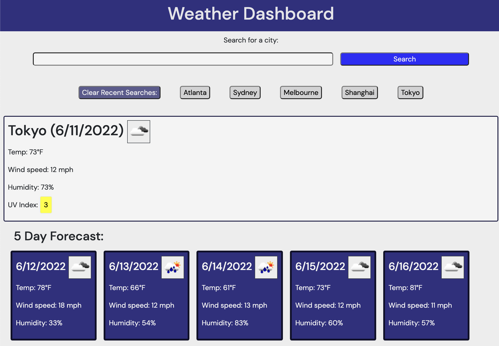

# Weather-App

## GT Bootcamp - Module 5 Challenge: Work Day Scheduler

This week was our first assignment that dealt with full scale API calls. We were tasked with building a weather dashboard that returned current weather conditions and a forecast based on the user's search. The assignment gave us an API to work with: The "One Call" API from Open Weather Map.

This API was pretty easy to use as far as gathering the data that was needed for the site. The biggest obstacle was that the API requried a search by lattitude and longitude, but the user would likely want to search by city. I found a JSON file on Open Weather Map's website which contained a list of the possible city choices with corresponding lattitude and longitude coordinates. But because the file was compressed, I could not figure out a way to access the file from the internet from within javascript. Instead I found a workaround by downloading the file to my local assets folder, then importing that file into a variable on page load.

The other issue was making sure the user searched something within that file, otherwise the API call would not return a result. Intead of having a "city not found" error message, I opted to use a JQuery UI autocomplete widget based on the possible choices from the city list.

After those two initial tasks, designing the page was pretty straightforward and reflected work I learned in previous challenges. Adding the API calls, however, really added another dimension to what can be accomplished in web development.

## [Deployed Application](https://mmmphoto.github.io/Weather-App)
## [Github Respository](https://github.com/MMMPhoto/Weather-App)

#### © 2022 Max McDonough

